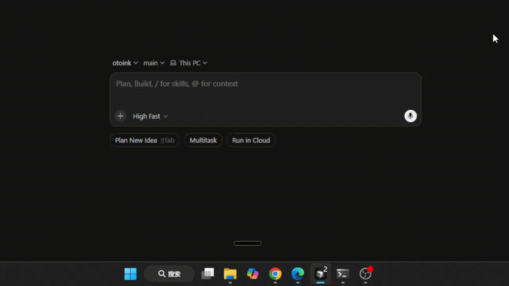
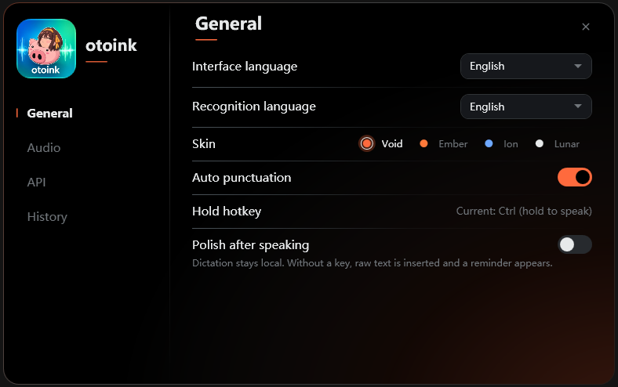
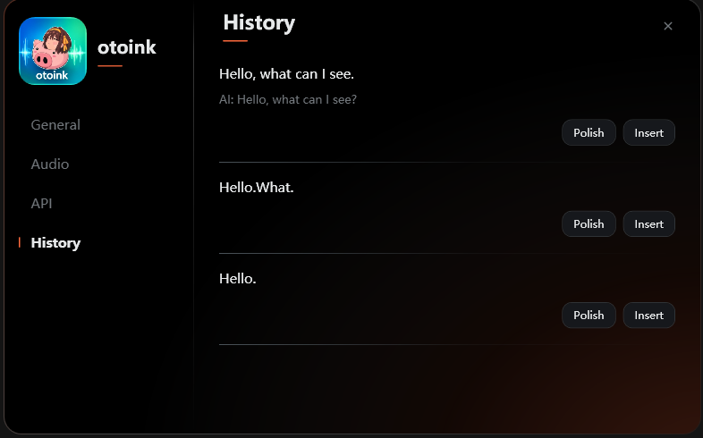

# otoink

[中文](README.md) · [English](README.en.md)

A desktop dictation bar. The name is oto (sound) + ink. MIT licensed.

Local **SenseVoice** (sherpa-onnx int8) does the listening. Audio never goes online. An OpenAI-compatible or Anthropic API key is **optional polishing only** — you can speak and type without one.



## Features

A thin capsule sits at the bottom of the screen and stays out of the way. Idle, it is almost a line; it expands on hover or while you hold to talk.


- **Hold `RightCtrl`** to speak, release to type; or **click the capsule**, then stop when you are done. Click × to cancel with no insert.
- Text goes into the window that was focused **when recording started**. Switching apps while you talk is fine.
- Dictation is always local. The API only rewrites text that was already recognized.
- Only one instance runs. Opening the EXE again brings the existing process forward.

### General

Interface language and recognition language are separate. Skins, auto punctuation, and the hold hotkey live here.

**Polish after speaking** is off by default. Turn it on for: local dictation → model polish → insert into the dialog. With no API key, the raw transcript is still inserted and a reminder appears. Typing is never blocked.



### History

Each transcript can be **polished** later, then **inserted** into the current window. Polished entries keep both the original and the AI text.



## Versus Win+H

- The bar does not disappear when you change windows
- Settings persist (language, punctuation, microphone, API)
- Recognition stays on-device; correction uses your own DeepSeek / OpenAI-compatible endpoint
- With polish off, otoink never calls the API
- With polish on and no key, the raw transcript still inserts, plus a toast

## Versus Dictto

DicttoDictto ([dictto-app/dictto](https://github.com/dictto-app/dictto)) relies on cloud ASR and requires an API key to function, whereas my project, otoink, handles recognition entirely locally. I learned a lot from Dictto's interaction design—such as its morphing capsule, click-to-talk, and separate settings window—and incorporated these ideas while building my own experience. (Dictto is licensed under AGPL-3.0).

## First run

The release is a folder. Next to `otoink.exe` you must have:

```text
models/sherpa-onnx-sense-voice-zh-en-ja-ko-yue-2024-07-17/model.int8.onnx
models/sherpa-onnx-sense-voice-zh-en-ja-ko-yue-2024-07-17/tokens.txt
```

The model is about 240MB and ships beside the app. It is **not** downloaded into `%LOCALAPPDATA%\otoink\models\`. Settings still live at `%LOCALAPPDATA%\otoink\settings.json`.

1. After unzip, it works **offline**.
2. Leave the API key empty.
3. Focus the window you want to type into, hold `RightCtrl` and speak, then release; or click the capsule and stop when done.
4. After 1–3 seconds the utterance appears in the window that was focused at the start.

Cancel: only the × on the left of the capsule in click-to-talk. There is no cancel hotkey. Releasing hold-to-talk always submits.

Downloads: GitHub [Releases](https://github.com/SZMY-haruhi/otoink/releases). Pick **one** zip (both include the model): `otoink-v*-win-x64.zip` if you already have the .NET 8 desktop runtime, or `*-full.zip` to run with no extra install.

## Development

Requires the .NET 8 SDK.

```bash
powershell -File scripts/Ensure-SenseVoiceModel.ps1
dotnet test
dotnet run --project src/Otoink.App/Otoink.App.csproj
```

`models/` is gitignored. The script copies int8 from an existing LocalAppData install when it can, otherwise it downloads into the repo `models/` folder (it does not write back to the user directory).

Self-contained publish:

```bash
powershell -File scripts/Ensure-SenseVoiceModel.ps1
dotnet publish src/Otoink.App/Otoink.App.csproj -c Release -r win-x64 --self-contained true -o artifacts/otoink-win-x64
```

Check that the publish folder contains `otoink.exe` and both model files. After launch, `%LOCALAPPDATA%\otoink\` should only gain `settings.json`, never a new `models\` folder.

## Manual checks

- Offline, empty API key: hold RightCtrl, speak, release; text lands in the starting window.
- Click the capsule for click-to-talk; × does not insert; Stop does.
- Switch to a browser while speaking; text still returns to the starting window.
- No gear, close, or history on the capsule. Tray left-click opens settings; right-click is settings / exit only.
- Settings can switch the UI to 简体中文.
- Polish on with no key still inserts the raw transcript and shows a toast.
- The General page shows every option without scrolling.
- Launching the EXE again does not start a second process; the bar toasts “Already running”.
