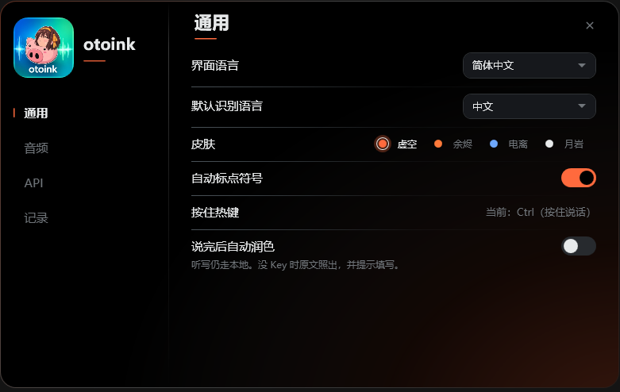
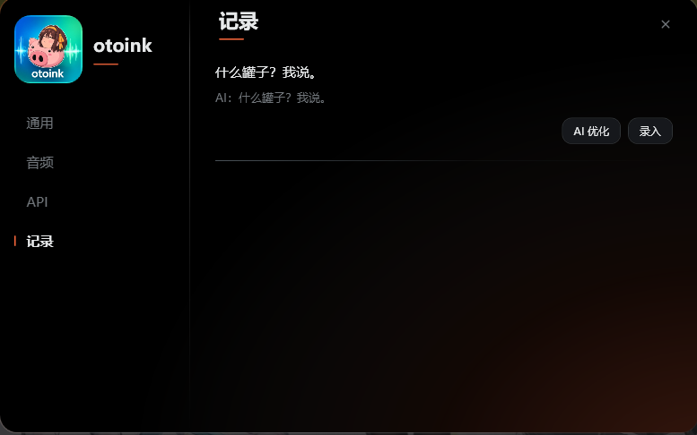

# otoink

[中文](README.md) · [English](README.en.md)

语音转文字桌面浮条。名字来自 oto（音）+ ink（墨）。MIT 协议。

本地 **SenseVoice**（sherpa-onnx int8）识别，音频不上网。OpenAI 兼容 / Anthropic API **只用于可选润色**；不填 Key 也能说话出字。


## 功能

底部一条很细的胶囊，不挡正在用的窗口。空闲时几乎只是一条线；悬停或按住说话时再展开。


- **按住 `RightCtrl` 说话**，松开后出字；或 **点击胶囊** 开始，说完点停止。点 × 取消、不出字。
- 字打进**开始录音时**的窗口。说话过程中切走也没关系。
- 听写始终走本机。API 只改已经听好的字，不会拿去听写。
- 程序只开一份：再双击 EXE 只唤起现有实例。

### 通用

界面语言和默认识别语言分开。可选皮肤、自动标点、按住热键。

**说完后自动润色**默认关闭。打开后：本地听写 → 模型润色 → 打进对话框。没填 Key 时原文照出，并提示去 API 页填写，**不拦出字**。



### 记录

每条识别稿可以事后 **AI 优化**，再 **录入** 到当前窗口。已润色的条目会同时留下原文和 AI 稿。



## 和 Win+H 的差别

- 切窗口不会消失
- 设置会记住（语言、标点、麦克风、API）
- 识别在本地完成；纠正用你自己的 DeepSeek / OpenAI 兼容接口
- 关掉「说完后自动润色」时不会自动请求 AI
- 开着润色但没 Key 时仍出识别稿，并出现气泡；不会拦住出字

## 和 Dictto 的差别

Dictto 的 ASR 走云端，没 Key 就不能录入。otoink 识别只走本地。可以学交互（底部变形胶囊、点击说话、设置独立窗）。

## 第一次能用

发布物是一个文件夹：`otoink.exe` 旁边必须有

```text
models/sherpa-onnx-sense-voice-zh-en-ja-ko-yue-2024-07-17/model.int8.onnx
models/sherpa-onnx-sense-voice-zh-en-ja-ko-yue-2024-07-17/tokens.txt
```

模型约 240MB，打进应用目录，**不会**再下载到 `%LOCALAPPDATA%\otoink\models\`。设置仍是 `%LOCALAPPDATA%\otoink\settings.json`。

1. 解压后**断网**也可以。
2. 不填 API Key。
3. 光标放在要打字的窗口，按住 `RightCtrl` 说话后松开；或点击底部胶囊，说完再点停止。
4. 1–3 秒后整段文字出现在开始录音时的那个窗口。

取消：只有点击说话时胶囊左侧的 ×。没有取消热键；按住说话松手就是提交。

下载：GitHub [Releases](https://github.com/SZMY-haruhi/otoink/releases)。请按电脑选其中一个压缩包（都已含模型）：已装 .NET 8 桌面运行时用 `otoink-v*-win-x64.zip`，解压即用选 `*-full.zip`。

## 开发

需要 .NET 8 SDK。

```bash
powershell -File scripts/Ensure-SenseVoiceModel.ps1
dotnet test
dotnet run --project src/Otoink.App/Otoink.App.csproj
```

`models/` 已被 gitignore。脚本会优先从本机已有的 LocalAppData 拷贝 int8，没有再下载到仓库 `models/`（不写回用户目录）。

自包含发布：

```bash
powershell -File scripts/Ensure-SenseVoiceModel.ps1
dotnet publish src/Otoink.App/Otoink.App.csproj -c Release -r win-x64 --self-contained true -o artifacts/otoink-win-x64
```

自检同一文件夹内有 `otoink.exe` 和上述两个模型文件。启动后 `%LOCALAPPDATA%\otoink\` 里只应出现 `settings.json`，不应新建 `models\`。

## 手动验收

- 断网、空 API Key，按住 RightCtrl 说话松手，字打进开始时的窗口。
- 点击胶囊进入点击说话，点 × 不出字；点停止会出字。
- 说话过程中切到浏览器，字仍打回开始时的窗口。
- 胶囊上没有齿轮、关闭、记录；托盘左键打开设置，右键只有设置 / 退出。
- 设置里可把界面切到 English。
- 「说完后自动润色」开着但没 Key 时仍出识别稿，并出现气泡。
- 设置通用页不必滚动即可看完全部选项。
- 程序已在运行时再开一次 EXE，不会出现第二份进程；浮条提示「已在运行」。
